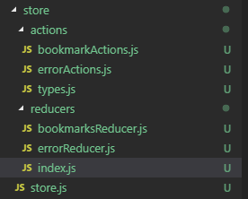

# Code-Challenge

TAPP Code Challenge for Software Engineer Candidates

- [Intro](#intro)
- [Time Limit](#time-limit)
- [User Interface](#user-interface)
- [Requirements](#requirements)
- [What We Are Looking For](#what-we-are-looking-for)

## Candidate Information (Fill out with your info)

Name: Tristan Perera

Email: tristan.e.perera@gmail.com

Phone: 951.476.5236

Resume: [Download my Resume](http://www.tristanperera.com/static/media/resume.98266cf9.pdf)

Additional: [My Github](https://www.github.com/trizmo)

Additional: [My LinkedIn](https://www.linkedin.com/in/tristan-perera)

## Installation Instructions
1: Download Expo app from Google Play Store and install

2: Scan QR Code:

## My Overview
First, I wanted to thank you for allowing me to accept this challenge. This was fun, and kinda frustrating at times lol. First I was debating on how I wanted to build this out. Should I build it with a back end server to help with database persistance and with auth? Should I use state management tools like Context or Redux? I know this could have easily blown out of control for such a tiny app, so I wanted to take it a little easier (or so I thought).

### Redux Version
I decided to build this app and utilize the state management system with Redux. I created this using expo, and create-react-native-app. I've utilized Redux with ReactJS twice, and I figured it would be similar if not exactly the same. First I built the first screen, and I set up the Navigation. That was pretty straight forward. I built out all the components to the store, set the actions and reducers, and then error. I concluded that navigtion props needed to be passed thru Redux as well, but I couldn't figure it out! After bashing my head directly into my keyboard for a few hours. In the wee hours of thursday morning I decided to scrap it. 

### SLnC - Simple Lovable nearly Complete
I bit off much more than I could have chewed, but I wasn't done! I took a step back and started a simple SIMPLE approach. I ended up completing the project using basic react native fundamentals with prop drilling. Since it was only a few screens and a handful of components, that make the task much easier. It has been awhile since I've done this too, since I learned Context right away and I haven't looked back at prop drilling since! It took me a few tries, but I was able to get that down and complete the basic structure of the app. Then I was able to move forward with the Google API calls. That was really really fun, and probably what I enjoyed the most.  Lastly, I touched styling. This was pretty easy and straight forward. Using `react-native-easy-grid`, and just some simple CSS, I got the app looking pretty clean. 

### What's Next
* There's no data persistance. I'd like to add Firebase DB, but ideally, I would like to create a NodeJS server and utilize MongoDB to hold all our data.  
* Authorization / User Login
* The `add to bookmarks` and `remove from bookmarks` don't properly work. 

## Intro

The goal of this challenge is to assess a candidate’s proficiency in Javascript, React Native and using APIs, by implementing a simple app that simulates a **Place Bookmarks** feature.

The candidate will:

- Fork our Code Challenge Github [repository](https://github.com/TAPP-Travel/Code-Challenge/tree/v1.1)
- Update `README.md` with their information
- Create a new folder called `/app`
- Work and make commits as they code to the `/app` folder
- Include a detailed `README.md` in `/app` on how to setup/configure and run the app
- Make their forked repo public accessible
- Submit to code-challenge@tapp.group with in time limit
  - subject line of your name, ‘submission’ and date. For example, "Tommy Tappson -Submission 08-22-2018"
  - body with link to your repo and roughly how long it took you to complete the challenge.

Good luck! Can’t wait to see your awesome code! If you have any questions, ask us at code-challenge@tapptravel.co

## Time Limit

The challenge must be submitted within 72 hours of receiving. The time heavily depends on how feature complete you want to make it. Realistically, you should not spend more than a day.

## User Interface

[Design Mockups](https://github.com/TAPP-Travel/Code-Challenge/tree/master/design)

You can open `/design/index.html` as a local file in your browser to view mockups. Assets are included in `/design/assets`.

The resulting app should have UI that closely resembles the provided design mockups. While it doesn’t have to be pixel perfect, the key relationships and design elements should be implemented.

## Requirements

- iOS App written in React Native - 3rd Party or Native Modules allowed
- Responsive Layouts (iPhone 6 or newer)
- Use of [Google Maps Platform](https://developers.google.com/maps/documentation/) (place autocomplete, place detail, place photo)

- **Bookmarks Screen**
  - Show carousel of bookmarked places, if any
  - Allowe user to search and add additional places to bookmarks
  - Weather and other non-bookmark information can be mocked
- **Search Screen**
  - Show results from Google Places Autocomplete as user types in search field
- **Place Screen**
  - Use Google Place Details to retrieve all relevant data, such as name, address, rating, and etc
  - Use Google Place Photo to show a photo from place
  - Use Google Place Static Maps to show a image of location on map
  - Correct ‘Bookmark’ button depending on if place is bookmarked

### Optional

These aren't required but are great to see!

- TypeScript - yep, we use it
- Redux integration
- Firebase integration - bookmarks stored in Firestore
- Detailed git commit history (we like seeing your coding process)
- Creative liberties to improve on functionality (following our UI design as guideline)
- Demo video - showcase any additional features

## What We Are Looking For

### General

- Code design
- File structure
- Intuitive naming
- Simple and readable code blocks
- Helpful comments
- Env-friendly configurations

### UI

- Fulfills UI design, see [User Interface](#user-interface)
- Navigation
- Responsive Layouting
- Components Composition
- Effective Styling

### Data

- State Management
- Data Structure

### APIs/Services

- Integration with UI and State
- Credentials Management
